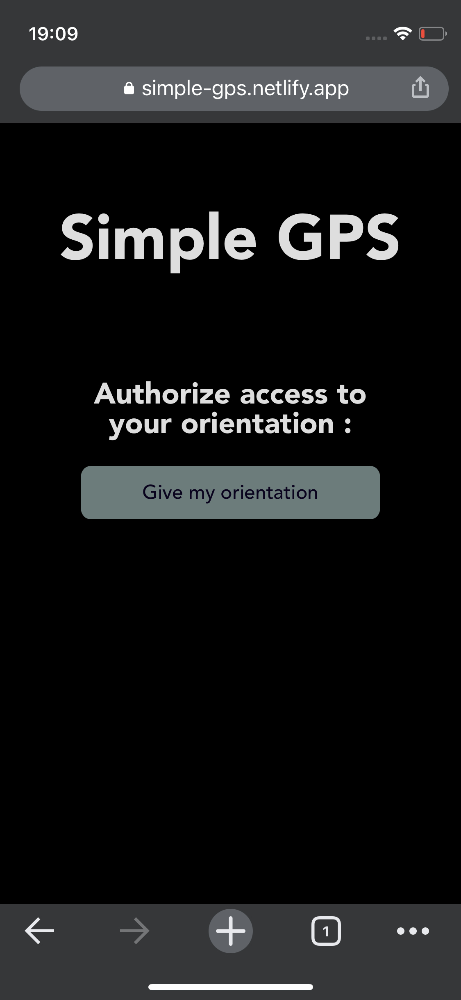
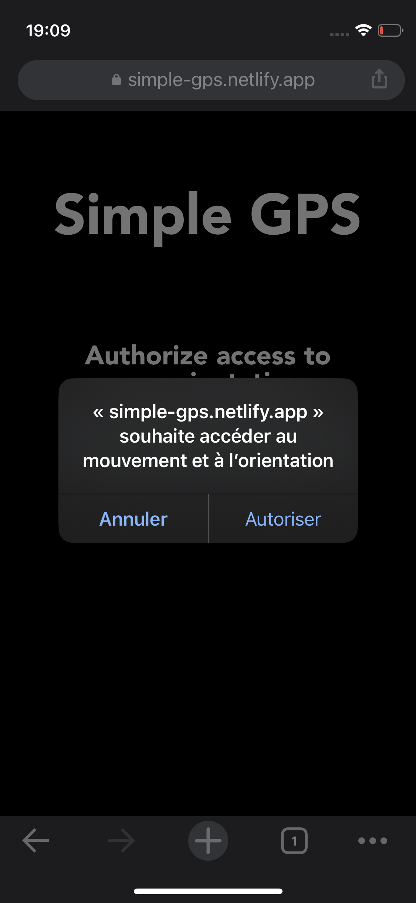
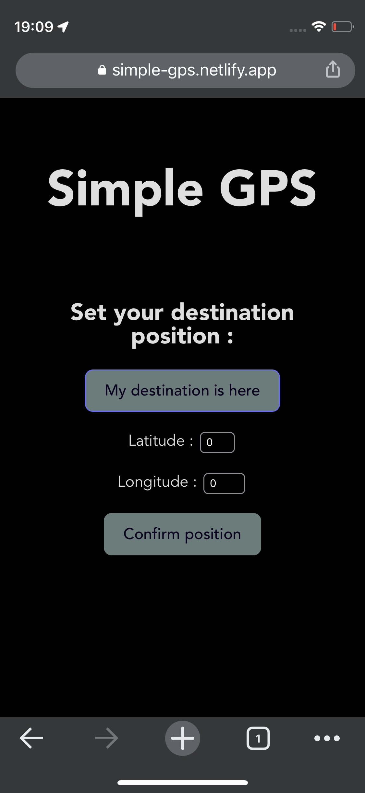
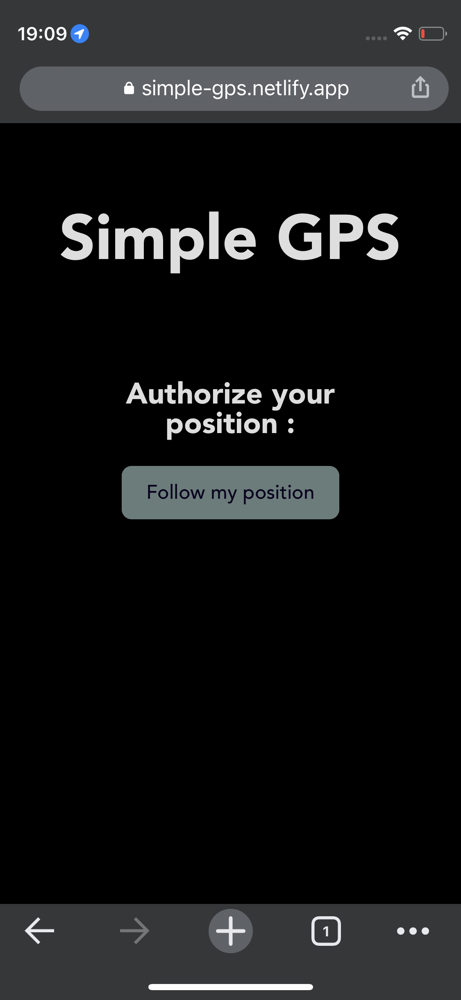
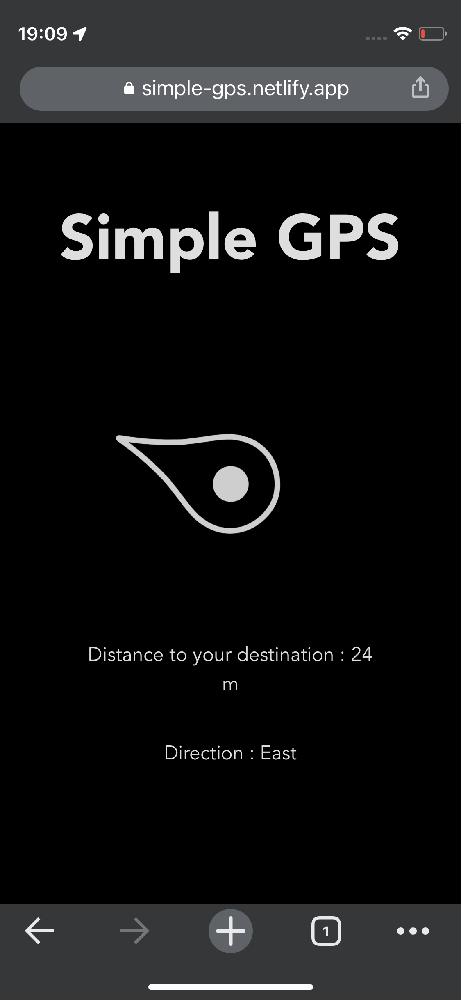
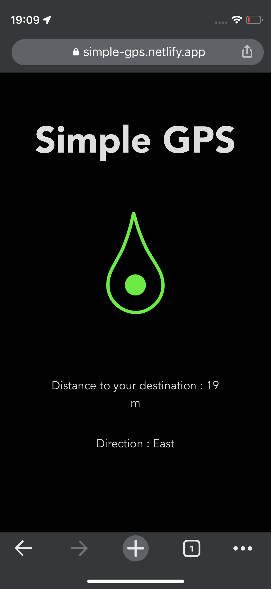

# Simple GPS

https://simple-gps.netlify.app/

Ce site web permet de donner la direction vers une position géographique ainsi que la distance jusqu'à celle-ci.
Le site est compatible avec les appareils mobiles uniquement.

Les tests ont étés effectués avec un Iphone sur l'application Google Chrome. 
Quelques positions GPS pour tester l'application :
- CNAM ENJMIN : latitude = 45.65425 / longitude = 0.14870
- Paris : latitude = 48.87604285748192 / longitude = 2.3416805902011513
- Pole nord : latitude = 90 / longitude = 0 (peut servir de boussole)

## Utilisation

Lorsque l'on arrive sur le site (en utilisant un smartphone), il est d'abord demandé d'autoriser l'accès aux données de mouvement et d'orientation du téléphone. 
Puis il faut renseigner son point de destination (il est possible de mettre la position du téléphone comme point de destination). 

Et enfin, il faut autoriser que le site web puisse suivre la position GPS du téléphone.

Une fois la mise en place effectuée, le site affichera une flèche qui indique la direction de la destination ainsi que la distance jusqu'à celle ci.

Si le téléphone est dans la bonne direction, la flèche devient verte.

## Problèmes rencontrés

- La couleur de la flèche semble se mettre à jour uniquement lorsque l'on zoom dans la page, je n'ai pas trouvé de solution à ce problème.

- Dans un premier temps, je voulais faire un système pour détecter les objets proches du téléphone (dans un rayon inférieur à 10m) mais je n'ai pas pu à cause du système de géolocalisation qui n'est pas suffisament précis.

- Le système devient imprécis quand la destination est dans un rayon inférieur à 10m autours de l'utilisateur.

- Je n'ai pas réussi à déterminer l'orientation vers le nord par le calcul alors j'ai implémenté une bibliothèque externe ([fulltilt](./src/lib/fulltilt.js)) pour le faire.

